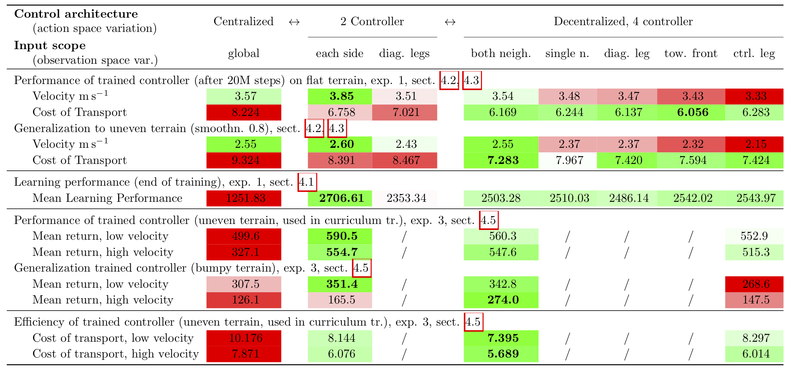

# DDRL
Deep Decentralized Reinforcement Learning - locally structured architecture for DRL in a continuous locomotion control task on a four-legged simulated agent.

The repository holds results and implementation for training a decentralized control architecture of a four-legged robot. It accompanies a submitted article: Malte Schilling, Andrew Melnik, Frank W. Ohl, Helge Ritter, and Barbara Hammer, Decentralized Control and Local Information for Robust and Adaptive Decentralized Deep Reinforcement Learning.

For questions, please contact: Malte Schilling, mschilli@techfak.uni-bielefeld.de

## Abstract

Decentralization is a central characteristic of biological motor control that allows for fast responses relying on local sensory information. In contrast, the current trend of Deep Reinforcement Learning (DRL) based approaches to motor control follows a centralized paradigm using a single, holistic controller that has to untangle the whole input information space. This motivates to ask whether decentralization as seen in biological control architectures might also be beneficial for embodied sensori-motor control systems when using DRL. To answer this question, we provide an analysis and comparison of eight control architectures for adaptive locomotion that were derived for a four-legged agent, but with their *degree of decentralization* varying systematically between the extremes of fully centralized and fully decentralized. Our comparison shows that learning speed is significantly enhanced in distributed architectures—while still reaching the same high performance level of centralized architectures—due to smaller search spaces and *local costs* providing more focused information for learning. Second, we find an *increased robustness of the learning process* in the decentralized cases—it is less demanding to hyperparameter selection and less prone to becoming trapped in poor local minima. Finally, when examining *generalization to uneven terrains*—not used during training—we find best performance for an intermediate architecture that is decentralized, but integrates only *local information}*from both neighboring legs. Together, these findings demonstrate beneficial effects of distributing control into decentralized units and relying on local information. This appears as a promising approach towards more robust DRL and better generalization towards adaptive behavior.

![Visualization of our decentralized approach for locomotion of a simulated agent. In a) the modified quadruped walking agent is shown (derived from an OpenAI standard DRL task, but using more realistic dynamic parameters and a modified reward function). In b) a sketch of a (fully) decentralized approach is shown: On the one hand, control is handled concurrently and there are multiple controller (only two are shown in green in the visualization), one for each leg which reduces the action space of each individual controller (e.g., a_HR, t). On the other hand, only limited input information is used (gray arrows on the left, S_HR, t and S_FR, t), in this case only information from that particular leg which dramatically reduces the input state space. Control policies are trained using DRL which is driven by a reward signal (R_t, as a simplification this is shown as shared between all controller). This overall simplifies learning of robust behavior considerably and leads, as will be shown, to better generalization.](Results/Figures/Quantruped_Architecture.png)

## Overview Repository

The repository consists of multiple parts, all written in Python, and there are multiple experiments:

* train_experiment_1_architecture_on_flat.py = Script for training models.  The first learning experiment aims to answer the question how does different control architectures—w.r.t. decentralization of the action space and input scope of the observation space–affect learning over time. Trained on flat terrain and aiming for running as fast as possible. Details, sect. 4.1 - 4.3.
* train_experiment_3_architecture_curriculum_targetvel.py Script for training models. The goal of the last task is to turn towards a more realistic scenario which brings us closer to realization on a robot. We aim for training an agent towards a stable walking speed in increasingly more and more difficult terrain. Details, sect. 4.6 and 4.7.
* evaluation = Folder with scripts for evaluation. These scripts are running trained controller and collecting data (velocity, return, distance, cost of transport) which are saved in panda files.
* Results = Contains trained models from first and third experiment, plus results from all the evaluations.
* stats = calculating statistical comparisons, based on previously run evaluations.
* visualization = producing figures (as used in the paper), based on previously run evaluations.

Run evaluation, visualization and stats scripts from the main working directory using python -O -m visualization.script_name.

Main control models and architectures are implemented in:
* models = neural network model (and Glorot initialization) used for DRL.
* simulation_envs = all control architectures for the first experiment, realized as RLlib multiagent environments.
* target_envs = all control architectures for the third experiment, realized as RLlib multiagent environments.

## Architectures

We compare different types of controllers that vary along two major feature dimensions: First, with respect to concurrency of control—splitting the action space of the whole agent into separate subspaces with their dedicated controllers, e.g., one controller for each leg. Second, we consider the scope of input information for each controller—splitting the observation space, e.g., using only local information for a decentralized controller from the controlled leg. Importantly, this is only sensible in the case of decentralized controller as we are considering information across a spectrum from, as a minimal input scope, only the controlled parts of the body up to including information from other parts of the body, e.g. a neighboring leg. 

Closely linked with the first dimension of decentralization of control is the structure of the reward signal used for training—in particular with respect to costs: Movement costs are directly related to decentralized control units and can be locally differentiated as well, taking into account costs only for the joints controlled by the decentralized controller. We will split up the reward structure accordingly to the decentralization and structure of the controller.

For further details, see paper section 3.1.

![Overview control architectures used for the four-legged agent. As a first differentiation, we distinguish concurrency for which the spectrum of different architectures is shown in a). In the centralized case (left), a single controller relying on all available information learns how to control all eight joints. Training is driven by one combined reward. Control can be split into multiple concurrent instances, e.g. one for each side (shown in the middle) or one for each leg (shown on the right, fully decentralized case). As a consequence, reward information can be more granular, e.g., only using costs associated with the joint movements of that particular leg. For a decentralized architecture, we can further distinguish the scope of information used as input to the controller (shown in b). In the fully decentralized case, the single leg controller only uses information from that particular leg and some global information (left). This scope can be broadened to include information from another leg as well (middle, there are further variations for which additional leg is providing information, not shown) or from both neighboring legs (right, called local information). Colors correspond to colors used in result sections for different types of architectures.](Results/Figures/Architectures.png)

## Requirements

Code is written in python (version 3.6).

As a framework for DRL we used Ray (version 1.0.1) and RLlib. Ray is a framework that allows to efficiently distribute python tasks on clusters implementing an actor model for concurrent processing. It offers an easy and unified interface for running parallel tasks which are internally modeled as a graph of dependent tasks that can be executed. RLlib as part of Ray provides a scalable and efficient DRL framework which as well is centered around these actor-based computations that simplify setting up parallel computation and encapsulation of information.

Experiments were run in simulation using the Mujoco physics engine. We used Mujoco in version 1.50.1.68

Deep neural network models were realized in tensorflow 2 (version 2.3.1)

## Results

Summary of results: Shown are main results from the experiments for the different control architectures. The architectures are, first, differentiated with respect to control (action space) into centralized and decentralized approaches. On a second level, we can further distinguish—for the decentralized architectures—what kind of information (observation space) each controller is using as an input. Rows show different experiments and evaluations. Single cell colors provide a relative comparison of results for a single measurement: For each row, a mean value is calculated over all different approaches. The color of a cell is set to white if the value is close to the mean; it is set to a green color if the value is better (higher for velocities and returns, lower for costs) compared to the mean, and to red if it is worse. Saturation of color indicates deviation of the mean for that particular cell (fully saturated color represents a deviation of more than one standard deviation of the mean).

There are videos from different simulation runs in the Result folder. Two main videos are summarizing the results from the first and, respectively, third experiment. Individual runs are as well provided.